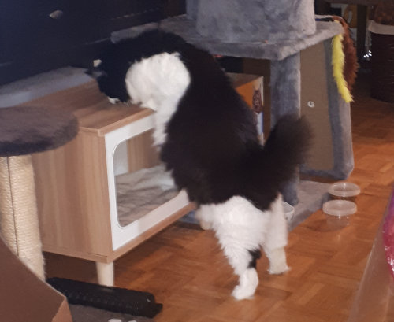

# cat_treats
Automatic cat treats

Demo: <https://sjchiass.github.io/cat_treats/>

## Background

Cats really like treats. Like, really, really like treats.

I used to hide them in places to give my cats a bit of an adventure, but I thought I was a bit too predictable or maybe too unimaginative. So I wrote down all the possible hiding spots I could think of. I could then use my computer to randomly sample them. This gives variety and unpreditability.

Doing this in Python is not hard. You can build your list of hiding posts as a nested dictionary. It makes it hierarchical and easy to read. 

The cats now spend more time looking for their treasures. While it used to take them 5 minutes to find everything, it now takes them closer to 30. If they miss a spot but smell that something is there, they keep revisiting until they find it.

## Running

Any basic Python should run the code since it only uses the `random` and `argparse` from the standard library (pre-installed).

The program accepts command-line arguments. You can run `python cat_treats.py --help` to get some hints. This comes from the [argpase library](https://docs.python.org/3/library/argparse.html).

The `--replacement` decides whether the code runs with `random.choices()` (replacement) or with `random.sample()` (without). If you want your hiding spots to have more than one treat, use `--replacement`. See [the documentation for random](https://docs.python.org/3/library/random.html).

## Usage

You can fork this repo and it should automatically generate a GitHub pages like this: <https://sjchiass.github.io/cat_treats/>. Let me know if it doesn't.

Alternatively, you can clone this to your Linux computer and add an entry to `crontab` with `crontab -e`. Wikipedia gives a [fairly good introduction](https://en.wikipedia.org/wiki/Cron).

## Cat tax

